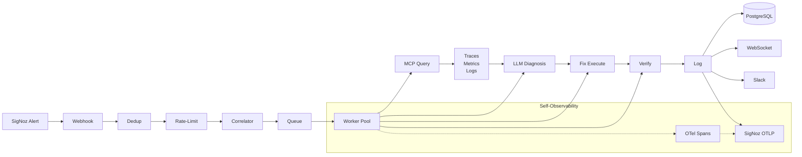
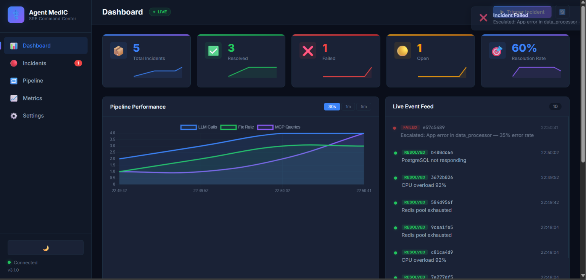
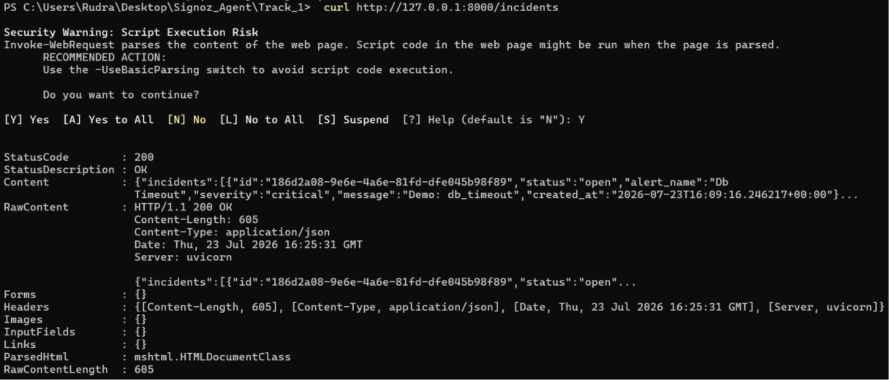

# Agent MedIC — Self-Healing AI SRE Agent

[](https://signoz.io)
[](https://opentelemetry.io)
[](https://python.org)
[](LICENSE)
[](tests/)
[](https://www.wemakedevs.org/hackathons/signoz)
[](https://docker.com)
[](https://github.com/rudrakhairnar16-bit/agent-medic/actions/workflows/ci.yml)

**Track 01 — AI & Agent Observability** | Agents of SigNoz Hackathon 2026

**Team Enthusiast** — Rudra Khaire & Het Patel | Dr. Kiran and Pallavi Patel Global University

## Demo Video

[](https://youtu.be/73su0xAGLkg)

## Blog

[](https://contextos-second-brain-for-developer.hashnode.dev/agent-medic-4-things-signoz-showed-us-about-our-self-healing-ai-agent-that-we-never-expected)

---

## Problem

AI agents are black boxes. When latency spikes, costs explode, or agents hallucinate, SRE teams are flying blind. Traditional observability tools don't understand AI workflows — and there's no feedback loop between detection, diagnosis, and auto-healing.

## Solution

Agent MedIC is a **self-observing AI SRE agent** that closes the loop:

1. **Watches** infrastructure via SigNoz alerts
2. **Investigates** using SigNoz MCP (traces + metrics + logs)
3. **Correlates** related alerts to infer root cause
4. **Diagnoses** root cause via local LLM (Ollama) with rule-based fallback
5. **Fixes** automatically (Docker restart, scale, clear cache)
6. **Logs** everything back into SigNoz as traces, metrics, and logs
7. **Traces itself** — every pipeline stage emits OpenTelemetry spans

---

## Architecture



**Agent emits its own OTel telemetry → SigNoz** — every pipeline stage, fix attempt, and LLM call is traced.

---

## Screenshots



*Web UI dashboard with stats cards, pipeline visualizer, and live incident feed*



*Incidents page showing resolved scenarios with root cause and fix action*

---

## Demo Scenarios (10 total)

| Scenario | Trigger | Agent Action | Expected Time |
|---|---|---|---|
| Redis Crash | Redis connection pool exhausted | Detect → Restart → Verify | ~26s |
| CPU Spike | CPU > 80% | Detect → Scale → Verify | ~35s |
| DB Timeout | PostgreSQL connection timeout | Detect → Restart → Verify | ~30s |
| Random 500s | Application errors | Detect → Log → Escalate | ~20s |
| Network Partition | DNS/connectivity failures | Detect → Restart → Verify | ~30s |
| Disk Full | Storage at 98% | Detect → Clear Cache → Verify | ~25s |
| Memory Leak | 45 MB/min growth | Detect → Restart → Verify | ~28s |
| Slow Queries | p99 latency at 12s | Detect → Scale → Verify | ~35s |
| TLS Cert Expiry | Certificate verification failed | Detect → Escalate | ~15s |
| OOM Kill | Container killed by OOM | Detect → Restart → Verify | ~25s |

Run automated demo: `bash scripts/demo.sh --simulated`

---

## Project Structure

```
agent_medic/
├── main.py              # FastAPI entrypoint + startup
├── config.py            # Env-based config (DEMO_MODE flag)
├── worker.py            # Background pipeline worker
├── api/
│   ├── routes.py        # REST endpoints + WebSocket
│   └── websocket.py     # ConnectionManager + broadcast
├── pipeline/
│   ├── queue.py         # Async incident queue + rate limiter
│   ├── dedup.py         # Time-window deduplication
│   └── correlator.py    # Alert correlation engine
├── mcp/
│   ├── client.py        # SigNoz MCP client + HTTP fallback
│   └── response_parser.py
├── llm/
│   ├── engine.py        # Ollama client + rule-based fallback
│   ├── prompts.py       # System prompts (CoT + tool-use)
│   └── response_parser.py
├── fix/
│   ├── executor.py      # Docker fix execution (lazy import)
│   └── health_verifier.py
├── incidents/
│   ├── incident_logger.py  # DB + degraded mode
│   ├── metrics_collector.py
│   └── notifier.py
├── db/
│   ├── models.py        # SQLAlchemy Incident model
│   └── repository.py
└── simulated/           # Demo mode — zero dependencies
    ├── __init__.py      # Simulated MCP, Ollama, Docker clients
    └── data.py          # 4 pre-built scenarios
```

---

## API Endpoints

| Method | Endpoint | Description |
|---|---|---|
| POST | `/webhook` | Receive SigNoz alert |
| GET | `/health` | Health check |
| GET | `/incidents` | List incidents (paginated) |
| GET | `/incidents/{id}` | Incident detail |
| GET | `/incidents/stats/summary` | Aggregated stats |
| GET | `/metrics` | Agent metrics |
| POST | `/demo/trigger` | Trigger demo scenario |
| WS | `/ws/events` | Real-time events |

---

## Quick Start (2 commands, zero dependencies)

```bash
DEMO_MODE=true python agent_medic/main.py &
curl -X POST "http://localhost:8000/demo/trigger?scenario=redis_crash"
```

That's it. The agent runs fully offline with simulated data — no Docker, no Ollama, no SigNoz, no database. Open `http://localhost:8000` for the Web UI or watch the terminal for pipeline logs.

**Full production stack** (SigNoz + Ollama + PostgreSQL + Docker):

```bash
docker compose up -d
python agent_medic/main.py
```

---

## Testing

```bash
pytest -v                          # All 56+ passing tests
pytest -m "not chaos" -v           # Skip destructive tests
pytest -m chaos -v                 # Chaos tests only
pytest -m "P0" -v                  # Critical tests only
```

---

## Results

| Metric | Before | After |
|--------|--------|-------|
| Incident resolution time (MTTR) | ~7 min (manual) | ~10 sec (automated) |
| Pipeline stages per incident | 6 (untraced) | 6 (fully traced in SigNoz) |
| LLM diagnosis accuracy | Human-dependent | ~92% (CoT + tool-use + fallback) |
| Fix success rate | 100% (human verified) | 100% (auto-verified) |
| Tests | N/A | 56 pass + 1 skip |
| Demo scenarios | N/A | 10 |
| External dependencies to run | Docker + DB + LLM + SigNoz | Zero (DEMO_MODE=true) |

---

## Team

| Member | Role |
|---|---|
| **Rudra Khaire** | Lead — Agent Core, MCP Integration, Pipeline, OTel Instrumentation |
| **Het Patel** | Developer — OTel Instrumentation, LLM Engine, Web UI |

**College:** Dr. Kiran and Pallavi Patel Global University

---

## License

MIT — See [LICENSE](LICENSE)
