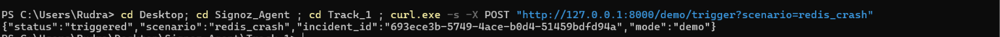
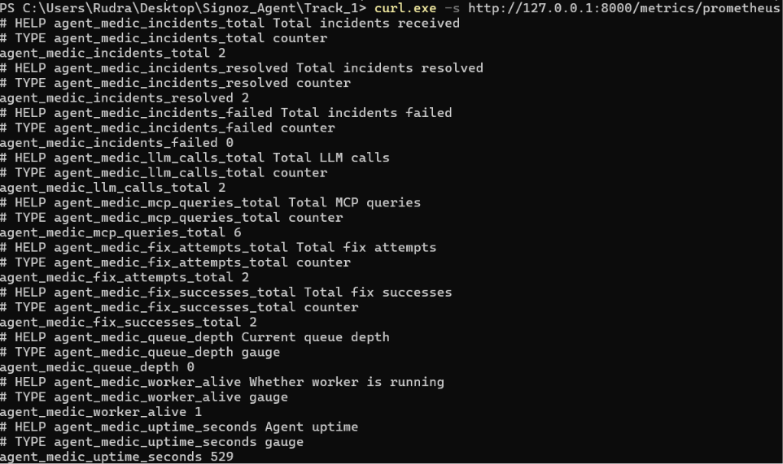

# Agent MedIC — Self-Healing AI SRE Agent

[](https://signoz.io)
[](https://opentelemetry.io)
[](https://python.org)
[](LICENSE)
[](tests/)
[](https://www.wemakedevs.org/hackathons/signoz)
[](https://docker.com)
[](https://github.com/rudrakhairnar16-bit/agent-medic/actions/workflows/ci.yml)

**Track 01 — AI & Agent Observability** | Agents of SigNoz Hackathon 2026

**Team Enthusiast** — Rudra & Het Patel | Dr. Kiran and Pallavi Patel Global University

## Demo Video

[](https://your-video-url-here.com)

See the full loop: alert triggers → agent traces itself in SigNoz → diagnoses via LLM → applies fix → verifies → logs back to SigNoz. All in under 60 seconds.

---

## Problem

AI agents are black boxes. When latency spikes, costs explode, or agents hallucinate, SRE teams are flying blind. Traditional observability tools don't understand AI workflows — and there's no feedback loop between detection, diagnosis, and auto-healing.

## Solution

Agent MedIC is a **self-observing AI SRE agent** that closes the loop:

1. **Watches** infrastructure via SigNoz alerts
2. **Investigates** using SigNoz MCP (traces + metrics + logs)
3. **Correlates** related alerts to infer root cause
4. **Diagnoses** root cause via local LLM (Ollama) with rule-based fallback
5. **Fixes** automatically (Docker restart, scale, clear cache)
6. **Logs** everything back into SigNoz as traces, metrics, and logs
7. **Traces itself** — every pipeline stage emits OpenTelemetry spans

---

## Screenshots

| SigNoz Dashboard — Agent Pipeline Traces | Web UI — Live Incident Feed |
|---|---|
|  |  |
| *Agent pipeline stages visible as OTel spans in SigNoz* | *Real-time WebSocket updates as agent processes alerts* |

## Architecture

```mermaid
flowchart LR
    A[SigNoz Alert] --> B[/webhook]
    B --> C[Dedup]
    C --> D[Rate-Limit]
    D --> E[Correlator]
    E --> F[Queue]
    F --> G[Worker Pool]

    G --> H1[MCP Query]
    G --> H2[LLM Diagnosis]
    G --> H3[Fix Execute]
    G --> H4[Verify]

    H1 --> I[Traces<br/>Metrics<br/>Logs]
    I --> H2
    H2 --> H3
    H3 --> H4

    H4 --> J[Log]
    J --> K[(PostgreSQL)]
    J --> L[SigNoz OTLP]
    J --> M[WebSocket]
    J --> N[Slack]

    subgraph Self-Observability
        G -.-> O[OTel Spans]
        O -.-> L
    end
```

**Agent emits its own OTel telemetry → SigNoz** — every pipeline stage, fix attempt, and LLM call is traced.

---

## Tech Stack

| Layer | Technology |
|---|---|
| Observability | SigNoz (Foundry) + OpenTelemetry |
| Agent Backend | Python FastAPI |
| LLM | Ollama (llama3.2 — local, free) + rule-based fallback |
| MCP | SigNoz MCP Server |
| Auto-Fix | Docker SDK (restart, scale, cache clear) |
| Alert Correlation | Rule-based engine (10+ failure patterns) |
| Database | PostgreSQL |
| Agent Tracing | OpenTelemetry (self-instrumented) |
| Frontend | Vanilla HTML+JS+WebSocket |
| Notifications | Slack webhook |
| Deployment | Docker Compose (8 services) |

---

## Demo Scenarios (10 total)

| Scenario | Trigger | Agent Action | Expected Time |
|---|---|---|---|
| Redis Crash | Redis connection pool exhausted | Detect → Restart → Verify | ~26s |
| CPU Spike | CPU > 80% | Detect → Scale → Verify | ~35s |
| DB Timeout | PostgreSQL connection timeout | Detect → Restart → Verify | ~30s |
| Random 500s | Application errors | Detect → Log → Escalate | ~20s |
| Network Partition | DNS/connectivity failures | Detect → Restart → Verify | ~30s |
| Disk Full | Storage at 98% | Detect → Clear Cache → Verify | ~25s |
| Memory Leak | 45 MB/min growth | Detect → Restart → Verify | ~28s |
| Slow Queries | p99 latency at 12s | Detect → Scale → Verify | ~35s |
| TLS Cert Expiry | Certificate verification failed | Detect → Escalate | ~15s |
| OOM Kill | Container killed by OOM | Detect → Restart → Verify | ~25s |

Run automated demo: `bash scripts/demo.sh --simulated`

---

## SigNoz Dashboards

| Dashboard | Panels |
|---|---|
| **Pipeline Performance** | Incidents processed, fix success rate, stage latency (p95), LLM calls, queue depth, resolution rate |
| **Service Health** | Error rate by service, p95 latency by service, CPU/memory by service, health score |
| **Alert Correlation** | Correlation groups by root cause, inter-alert delay, top root causes |

---

## API Endpoints

| Method | Endpoint | Description |
|---|---|---|
| POST | `/webhook` | Receive SigNoz alert |
| GET | `/health` | Health check |
| GET | `/incidents` | List incidents (paginated) |
| GET | `/incidents/{id}` | Incident detail |
| GET | `/incidents/stats/summary` | Aggregated stats |
| GET | `/metrics` | Agent metrics |
| POST | `/demo/trigger` | Trigger demo scenario |
| WS | `/ws/events` | Real-time events |

---

## Quick Start (2 commands, zero dependencies)

```bash
DEMO_MODE=true python agent_medic/main.py &
curl -X POST "http://localhost:8000/demo/trigger?scenario=redis_crash"
```

That's it. The agent runs fully offline with simulated data — no Docker, no Ollama, no SigNoz, no database. Open `http://localhost:8000` for the Web UI or watch the terminal for pipeline logs.

**Full production stack** (SigNoz + Ollama + PostgreSQL + Docker):

```bash
docker compose up -d
python agent_medic/main.py
```

---

## Testing

```bash
pytest -v                          # All 56+ passing tests
pytest -m "not chaos" -v           # Skip destructive tests
pytest -m chaos -v                 # Chaos tests only
pytest -m "P0" -v                  # Critical tests only
```

---

## Team

| Member | Role |
|---|---|
| **Rudra** | Lead — Agent Core, MCP Integration, Pipeline, OTel Instrumentation |
| **Het Patel** | Developer — OTel Instrumentation, LLM Engine, Web UI |

**College:** Dr. Kiran and Pallavi Patel Global University

---

## Prizes Target

| Prize | Track | Status |
|---|---|---|
| Apple MacBook (per member) | Track 01 — AI & Agent Observability | 🎯 |
| LEGO Ferrari SF-24 | Side — Best Blog | 📝 |
| AWS Credits ($5K/$3K/$2K) | Cloud Sponsor | ☁️ |
| SigNoz Job Interview | Top blogs | 💼 |
| Exclusive Swag | Social media posts | 🎁 |

---

## License

MIT — See [LICENSE](LICENSE)
